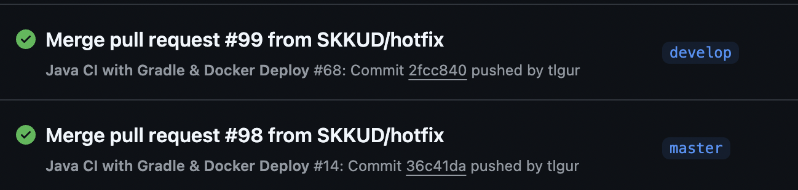

# **SKKLUB Renewal**: SKKU Club Management and Recruiting Service

### This is a fork of [SKKUD/skklub-backend](https://github.com/SKKUD/skklub-backend).

 

# Project Description
**SKKLUB** is a web service developed by SKKU:D, a student development club at Sungkyunkwan University (SKKU), aimed at enhancing the quality of college life. The platform supports over *260* university clubs, helping them manage their operations and recruit new members more efficiently. SKKLUB addresses the lack of existing solutions for club-related challenges by providing a centralized and user-friendly system.

The project involved a comprehensive renewal of the SKKLUB platform, initiated due to the poor quality of its original codebase and database structure. Through this effort, SKKU:D redesigned and improved the system to ensure better functionality, maintainability, and user experience.

 

# Contribution
- **CI/CD pipeline:** Implemented a CI/CD pipeline using GitHub Actions to automate testing, building, and deploying the application.
    - Configured ***docker image***
    - Configured ***docker-compose.yml***
    - Configured ***Github Actions***, automating dockerizing and deployment of both `develop` and `master` branches on ec2

        

     

- **Data migration:** Migrated existing data from the old database to a new database, making more organized structure and ensuring data integrity.

    - **Designing new structure**

        - Due to poor database structure with NoSQL, we decided to change the database structure with more structured way. We utilized SQL instead of NoSQL and modified column names and data types, added new columns and constraints, and grouped relevant data with new tables.

            - Previous club table

              

            - New club table
              
                
    
     

    - **Extracting data from old database**
        - Used MySQL Workbench to export each table containing data to csv
            
    
     
    
    - **Migrating data**
        - Rearranged data with relevant table
            - ex) moving `president_name` and `president_contact` columns into `Club` table to separate `User` table
            
        - Imported csv (or excel) to database
            
        - Used Python for those that can be automated
    
     
    
    - **Validation**
        - Used aggregate functions, validating number of columns for each table
        - Used checksum functions, comparing previous table with new table
        - Checked each club manually 
        - Tested application

 

# Technologies
- **CI/CD pipeline:** Github Actions, Docker

- **Data migration:** MySQL, CSV, Python
