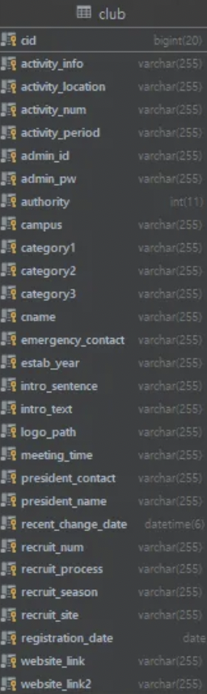

# **SKKLUB Renewal**: SKKU Club Management and Recruiting Service

### This is a fork of [SKKUD/skklub-backend](https://github.com/SKKUD/skklub-backend).

 

# Project Description
SKKLUB is a web service implemented by SKKU:D, a development club in SKKU mainly focuses on enhancing college life quality. The service aims to help clubs easily manage and recruit new members due to absence of a platform supporting club related problems. SKKU:D proceeded renewal of SKKLUB due to its poor quality of code and database structure.

 

# Contribution
- **CI/CD pipeline:** Implemented a CI/CD pipeline using GitHub Actions to automate testing, building, and deploying the application.

- **Data migration:** Migrated existing data from the old database to a new database, making more organized structure and ensuring data integrity.

    - Enhancing structure

        - Due to poor database structure with NoSQL, we decided to change the database structure with more structured way. We utilized SQL instead of NoSQL and modified column names and data types, added new columns and constraints, and grouped relevant data with new tables.

            - Previous club table
                

            - New club table
                
    - Extracting data
        - Used MySQL Workbench to export each table containing data to csv
            

    - Migrating data
        - Rearranged data with relevant table
            - ex) moving president_name and president_contact  columns in Club table to separate User table
            
        - Importing csv (or excel)
            
 

# Technologies
- **CI/CD pipeline:** Github Actions, Docker

- **Data migration:** MySQL, CSV, Python